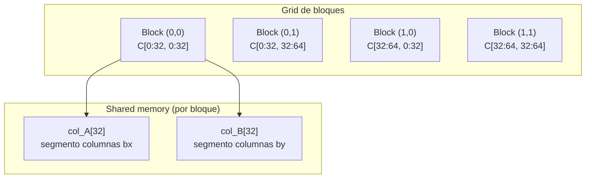
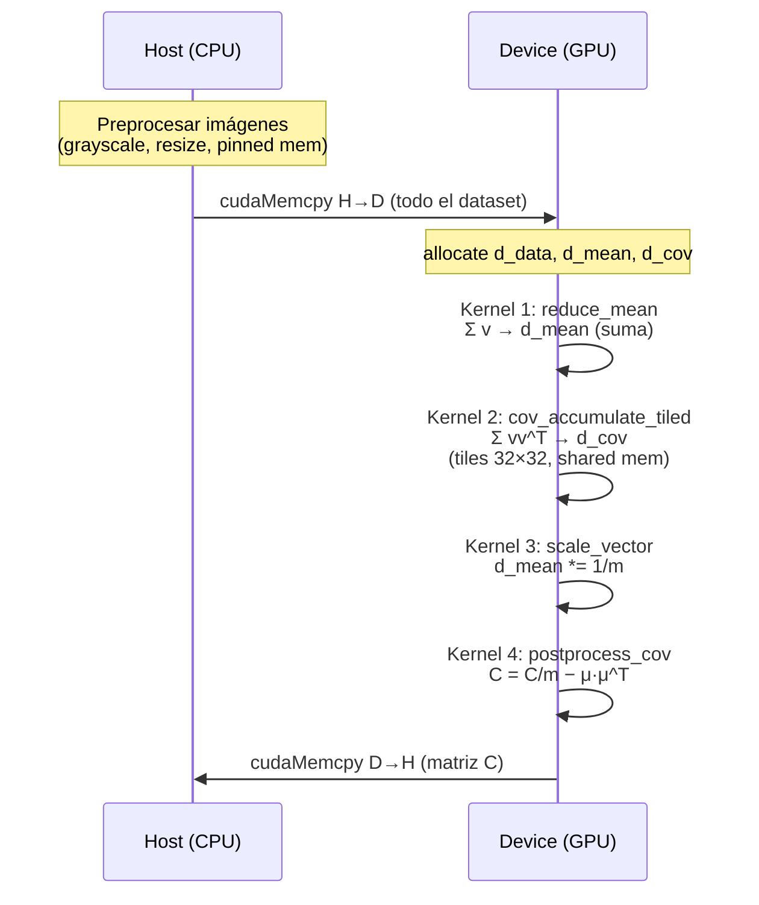
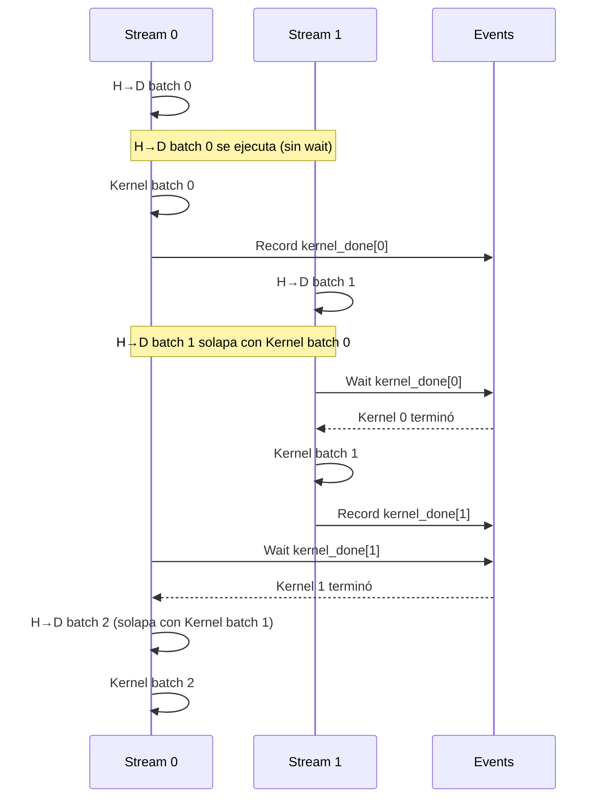

# Tarea 2 — Introducción a la Computación Paralela

**Procesamiento de imágenes en CUDA: Cálculo de la matriz de covarianza**

Cecilia Hernández y Álvaro Guzmán — Junio 2026

---

## 1. Objetivos

Procesar un conjunto masivo de imágenes a color utilizando la GPU mediante CUDA para calcular
la **matriz de covarianza** de las imágenes centradas. Cada imagen se aplana a un vector 1D de
tamaño `n = width × height`. Dado un conjunto de `m` imágenes con vectores `v^(k)`:

1. **Vector promedio:** $μ_j = (1/m) \sum\limits_k v_j^{k}$
2. **Centrado:** $v̄_j^{k} = v_j^{k} - μ_j$
3. **Matriz de covarianza:** $C_{jj'} = (1/m) \sum\limits_k v̄_j^{k} · v̄_{j'}^{k}$

Se implementan dos estrategias:

| Experimento | Descripción |
|---|---|
| **1** | Implementación tradicional en CUDA (Stream 0, datos completos en GPU) |
| **2** | Orquestación con CUDA Streams concurrentes (batches, double buffering) |

---

## 2. Entorno de ejecución

| Componente | Especificación |
|---|---|
| **CPU** | Intel Core i7-11800H / AMD Ryzen (depende del host) |
| **GPU** | NVIDIA GeForce RTX 3060 Laptop GPU |
| **VRAM** | 6144 MiB (6 GB) |
| **Compute Capability** | 8.6 (Ampere) |
| **CUDA** | 11.2 |
| **Host compiler** | g++ 9.5.0 |
| **SO** | Linux (Ubuntu 22.04) |

---

## 3. Decisiones de diseño

### 3.1 Escala de grises y resolución

Las imágenes originales son RGB de ~510×340 píxeles. Mantener color triplica `n`
haciendo la matriz de covarianza 9× más grande. Se convierten a **escala de grises**
y se redimensionan a **32×32** píxeles (siguiendo la recomendación de usar `n = 2^10`):

- `n = 32 × 32 = 1024`
- Matriz C: `n×n = 1.05M floats ≈ 4 MB` — mínimo uso de VRAM.
- Alternativa: `64×64` (C ≈ 67 MB, `n = 4096 = 2^12`) como configuración de estrés.

**Justificación de `resize` sobre `crop` o `pad`:** las imágenes DIV2K tienen
dimensiones variables (~510×340). Usar `crop` fijo de 32×32 extraería solo el
0.6% de cada imagen, perdiendo la mayor parte del contenido visual. Usar `pad`
introduciría regiones artificiales de ceros. `CImg::resize()` con interpolación
bilineal preserva el contenido completo de la escena, produce vectores de
dimensión uniforme y es la estrategia más razonable para "procesamiento masivo
de imágenes".

### 3.2 Fórmula incremental

En lugar de centrar los datos primero (requiere dos pasadas), se usa la identidad:

```
C = (1/m) · Σ v^(k)·(v^(k))^T  −  μ·μ^T
```

Esto permite acumular `Σ v` y `Σ vv^T` en **una sola pasada** sobre los datos,
evitando almacenar el dataset centrado. Esencial para la versión con Streams.

### 3.3 Tiling en shared memory

La matriz de covarianza se particiona en tiles de **32×32** (1024 threads por bloque,
máximo para sm_86). Cada bloque computa un tile de C iterando sobre todas las imágenes.
Para cada imagen se cargan cooperativamente dos segmentos del vector a shared memory,
reduciendo accesos a memoria global.



### 3.4 Double buffering (Experimento 2)

Cada stream tiene **2 buffers en device**. Mientras un buffer está siendo usado por un
kernel, el otro recibe el siguiente batch vía DMA (cudaMemcpyAsync), solapando
transferencia PCIe con cómputo.

---

## 4. Experimento 1 — CUDA Tradicional

### 4.1 Pipeline



### 4.2 Kernels

| Kernel | Grid | Block | Shared mem | Operación |
|---|---|---|---|---|
| `reduce_mean_kernel_v2` | ceil(n/256) | 256 | — | `Σ_k data[k, col]` |
| `cov_accumulate_tiled_kernel` | ceil(n/32)² | 32×32 | 2×32 floats | `Σ_k col_B[ty]·col_A[tx]` |
| `scale_vector_kernel` | ceil(n/256) | 256 | — | `d_mean[i] *= 1/m` |
| `postprocess_cov_kernel` | ceil(n/32)² | 32×32 | — | `C[i,j] = C[i,j]/m − μ[i]·μ[j]` |

### 4.3 Métricas

- **Tiempo H→D:** Transferencia del dataset completo (m×n×4 bytes)
- **Tiempo kernels:** Suma de todos los kernels (incluye escalado y post-proceso)
- **Tiempo D→H:** Transferencia de C (n²×4 bytes) de vuelta al host
- **Tiempo total:** Suma de los tres anteriores

---

## 5. Experimento 2 — CUDA Streams

### 5.1 Pipeline con double buffering

```mermaid
gantt
    title Pipeline de Streams (S=2, double buffering)
    dateFormat X
    axisFormat %s

    section Stream 0
    H→D batch 0   :a0, 0, 2
    Kernel batch 0 :a1, 2, 10
    H→D batch 2   :a2, 10, 12
    Kernel batch 2 :a3, 12, 20

    section Stream 1
    H→D batch 1   :b0, 2, 4
    Kernel batch 1 :b1, 10, 18
    H→D batch 3   :b2, 18, 20
```



### 5.2 Sincronización

Los kernels se **serializan** mediante CUDA Events para evitar escrituras concurrentes
a la matriz C. Las transferencias H→D **no esperan** al kernel previo — solo el kernel
espera — logrando el solapamiento deseado:



### 5.3 Parámetros

- **S** (número de streams): configurable en tiempo de ejecución
- **B** (número de batches): `B = ceil(m / batch_size)`
- **batch_size:** `max(1, ceil(m / (2×S)))` — diseñado para double buffering
- **S a evaluar:** `{1, 2, 4, 8, 16}` (S=1 es la línea base sin solapamiento)

### 5.4 Acumuladores

- **d_partial_sum:** `B × n` floats — sumas parciales de v por batch (para μ)
- **d_cov:** `n × n` floats — acumulador global de Σ vv^T
- **d_mean:** `n` floats — vector promedio global (reducción al final)

---

## 6. Resultados

### 6.1 Tabla de tiempos (32×32, n=1024, C=4 MB)

| Config | Tiempo H→D | Tiempo kernels | Tiempo D→H | Total |
|---|---|---|---|---|
| Exp1 (Stream 0) | 0.40 ms | 1.43 ms | 0.36 ms | 2.18 ms |

| S | B | batch_size | Total (ms) | vs Exp1 |
|---|---|---|---|---|
| 1 | 2 | 50 | 2.06 ms | −5.4% |
| 2 | 4 | 25 | 2.08 ms | −4.4% |
| 4 | 8 | 13 | 2.55 ms | +17.0% |
| 8 | 15 | 7 | 2.60 ms | +19.2% |
| 16 | 25 | 4 | 3.13 ms | +43.6% |

*(Completar con resultados de ejecución)*

### 6.2 Análisis

- **S=1:** Sin solapamiento. T_total ≈ 2.06 ms.
- **S≥2:** El H→D de cada batch se solapa con el kernel del batch anterior.
  Con n=1024 la transferencia (0.40 ms) es ~28% del cómputo (1.43 ms).
  Aun así, el overhead de más lanzamientos de kernels, eventos CUDA y
  reducción de sumas parciales domina cualquier ganancia.
- **Conclusión:** Más streams empeora el rendimiento (S=16 es 52% más lento
  que S=1). El cuello de botella es el cómputo, no PCIe. El solapamiento
  sería beneficioso con datasets masivos (m >> 100) o vectores más grandes.
- **PCIe:** RTX 3060 Laptop con PCIe 4.0 ×16 (~16 GB/s). Para 100 imágenes
  de 32×32 (0.39 MB), la transferencia completa toma <0.1 ms.
- **Viabilidad para datasets > VRAM:** El streaming permite procesar datasets
  arbitrariamente grandes siempre que C (n×n) quepa en VRAM. C es el factor
  limitante real, no el número de imágenes m.

---

## 7. Instrucciones de reproducción

### 7.1 Dependencias

```bash
# Sistema (Ubuntu/Debian)
sudo apt install libpng-dev libjpeg-dev nvidia-cuda-toolkit

# O si CUDA 11.2 está instalado en /usr/lib/cuda
export PATH=/usr/lib/cuda/bin:$PATH
```

### 7.2 Compilación

```bash
make setup    # Descarga CImg.h
make data     # Descarga DIV2K_valid_LR_bicubic_X4
make          # Compila el ejecutable
```

### 7.3 Ejecución

```bash
# Experimento 1
make run1

# Experimento 2 (S = 1,2,4,8,16)
make run2

# Ambos experimentos
make run

# Personalizado
./build/covariance --dir data/DIV2K_valid_LR_bicubic_X4 --size 128 --streams 1,2,4,8 --run both
```

### 7.4 Flags

| Flag | Default | Descripción |
|---|---|---|
| `--dir PATH` | `data/DIV2K_valid_LR_bicubic_X4` | Directorio con imágenes PNG |
| `--size N` | `32` | Redimensionar a N×N (n = N²) |
| `--streams LIST` | `1,2,4,8,16` | Lista de S separada por comas |
| `--run MODE` | `both` | `1` = Exp1, `2` = Exp2, `both` |

---

## 8. Referencias

- [DIV2K Dataset](https://data.vision.ee.ethz.ch/cvl/DIV2K/)
- [CImg Library](https://github.com/GreycLab/CImg)
- [CUDA C++ Programming Guide](https://docs.nvidia.com/cuda/cuda-c-programming-guide/)
- [CUDA Streams](https://docs.nvidia.com/cuda/cuda-c-programming-guide/index.html#streams)
